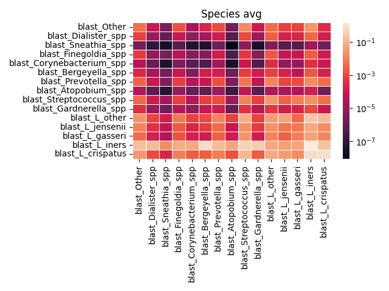

# LSTM for the Human Microbiome
This project uses an LSTM RNN approach to predict microbial profiles from prior timepoint. In this specific example, we are using data from:

<a href="https://journals.asm.org/doi/10.1128/mSphere.00593-20">Daily Vaginal Microbiota Fluctuations Associated with Natural Hormonal Cycle, Contraceptives, Diet, and Exercise</a> by Stephanie D. Song, Kalpana D. Acharya, Jade E. Zhu, Christen M. Deveney, Marina R. S. Walther-Antonio, Marc J. Tetel, and Nicholas Chia

which has been downloaded and cleaned-up in file "VMBData_clean.xlsx" (by Yash Lal). This is a work-in-progress and the current working version is lstm_multichannel6.py. The hyperparmeters need to be changed in this file and the results give best testing trajectory from all runs in the ensemble:

The log-error after ablating (setting to average) different data features:

The log-error after ablating data from different time points:

